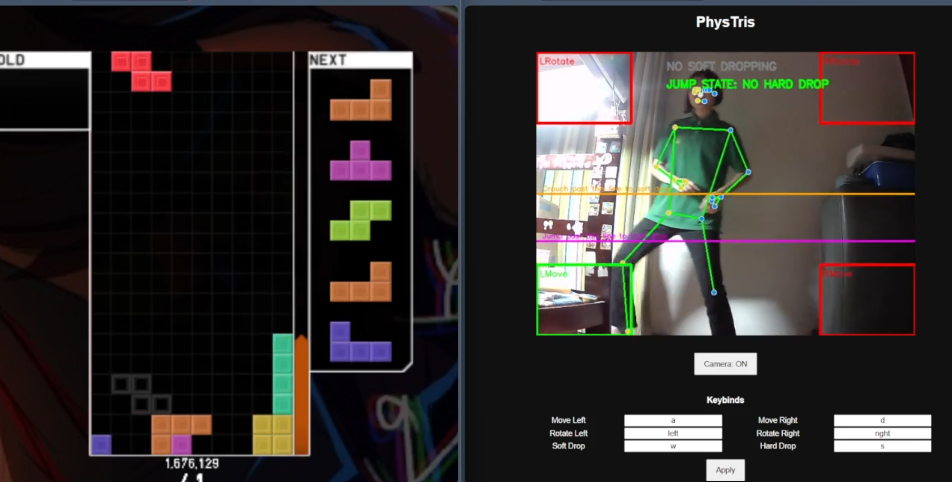

# phystris

<p align="center">
  
</p>

<p align="center">Essentially Tetris, but you're going to have a REAL bad time.</p>

## PhysTech 2026
Intended to be a submission for [PhysTech 2026](https://phystech-2026.devpost.com/).

This is an ongoing competition. I will update if anything comes up.

## Inspiration
I loved playing Kinect Sports as a child. I’d go as far as saying that it was one of *the* big highlights of my early childhood. But by the time I was aware enough to like and be capable of doing tech stuff, they don’t manufacture Kinects anymore. 

They just keep discontinuing stuff that were part of my childhood. That's just the curse of time, and yet you also forget. Sherlock, as a child, had held onto this memory above a lot of other things that they also loved.

And I'd give anything to feel like that again.

I’m not a person with lots of things that I can say definitely that I like. 

If you trap me in a room with a laptop and food under threat of playing only one game for a month straight, I’d probably play Tetris. I’d stack blocks for hours. It’s just me and this one stranger in the world that I’m trying to arrange these 7 tetrominoes against. My fingers have already familiarised themselves with speed from all these years of piano. In joy and in despair and in sheer desperate anger, I can and will play this game. You can pretty much say it’s kind of an addiction. Anyone worth their salt will describe me as such.

Personally, I don't want to suffer from this ailment of being exceedingly sedentary despite being happy. So, I take a leaf out of Michael Reeves' book and question myself, *why don’t I just make something that normal people enjoy so, so much worse.*

I want to make a thing that I have come to love become terribly arduous to enjoy.

Thus, I decided to create **PhysTris**, a practical-use program that connects physical movements to controls for Tetris, and get people to play a classic game in a newer, more physically demanding way.

## What it does
Essentially a macro for Tetris, but you’re going to have a really good time exercising. If you happen sit around a lot of the time, all the better.

There's not much you need for this game:
- a computer with a camera
- an area big enough that you can jump around in; prefer places with a plain background.

## Instructions
To run this project on your device: 
```
git clone https://github.com/SherlockWalker/phystris/
cd phystris
python -m venv .venv
venv\Scripts\activate
pip install fastapi uvicorn opencv-python mediapipe numpy
uvicorn server:app --reload
```

Then open up http://127.0.0.1:8000/ on your browser to run.
- Start the camera! Or pause the camera if you don't want to use it anymore
- Switch into your favourite Tetris version (I personally play TETR.IO, thank you osk)
- You can modify configs in the page also to change your keybinds for the game.

## How we built it
- A laptop, and an external fisheye webcam (because the one on my laptop broke and would only work when it’s tilted at certain angles).
- External libraries used: cv2, MediaPipe, FastAPI

## Challenges we ran into
Admittedly I ran into a lot more problems than I bargained for.

First of all, I’m happy that I can work around the terrible documentation of the MediaPipe API that Google gave. I didn't have the input/output types of the functions on hand, so I had to trial and error a lot of things. But anyways, it works super well and draws the human frame consistently enough that I can run this program.

Secondly, I have terrible time management, and was doing 60% of this project during the middle of my university exam season.

## Accomplishments that we're proud of
I have not touched Python in some time due to my studies at university. Also, I’m not really used to creating and maintaining code between libraries in Python, so this has been quite fun. 

Most of this project was done within the span of 2 weeks. 

## What we learned
First and foremost, I shouldn’t dev projects when I’m also trying not to perish from exams within days of the deadline. Can't help it though, I got my idea too late!

In any case, if I am ever going to build a public library in any programming language, I should probably provide as detailed documentation as possible so as to not inconvenience any potential users of it in the future.

## What's next for PhysTris?


<p align="center"><b>Initial idea for PhysTris movement system.</b></p>

It’s built on the idea that macro keyboard for games exist. Anyways, we can have competitive Tetris in a way that doesn’t make you have to sit for hours, and you can have fun with your friends with it.

Multiplayer is definitely possible, since MediaPipe allows tracking of up to 4 people. It’s a bit too crowded even with just 2 people in a single camera frame though, so I left it to single player.

Additionally, I want to try and make this project more accessible to normal users instead of having to go through the process of installation via the terminal.

I'd also like to natively make Tetris in this project instead of just making this a macro, building an online fight system for PhysTris instead of relying on using other sites (TETR.IO, etc. within reason of not violating Tetris' copyright). Other than that I'll be using the SRS (NOT SRS-180, despite me playing TETR.IO, and for other reasons I'll mention later) kick table for the Tetris bit.

## Other notes
Thank you so much to my university friends, who had informed me of PhysTech 2026, and encouraged me to complete this project. 

I wish to publish a variety of other projects in the near future. Hope you have enjoyed your stay in my little digital dwelling. Please tell me what you think about PhysTris, you can contact me to ask about stuff done here!
